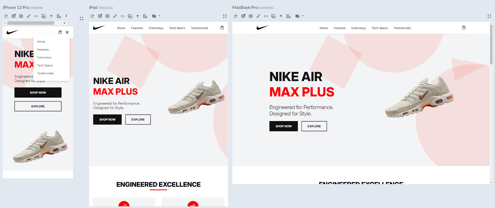

# 👟 Nike Air Max Plus Landing Page

A bold, responsive, and accessible **Nike Air Max Plus landing page** built with **HTML** and **CSS** — featuring modern layout techniques, interactive elements, and real product showcases.  
Designed by **Stephen William G. De Jesus**, this project highlights the fusion of performance and style using structured sections, ARIA accessibility roles, and modern design patterns.

---

## 📸 Preview  

### 🎞️ Live Interaction (GIF)  


### 🖼️ Static Screenshot (PNG)  


---

## 🌐 Live Demo  
[View Live Demo](https://bogiiiie.github.io/05-html-css-nike-landing-page/)

---

## 📁 Features

✅ Hero section with strong branding and call-to-action buttons  
✅ ARIA roles for accessibility across navigation and content sections  
✅ Features grid with Material Symbols icons  
✅ Colorway product cards with image previews, prices, and purchase links  
✅ Technology section showcasing specs with visual structure  
✅ Testimonials section with avatar reviews and star ratings  
✅ Fully responsive layout for desktop, tablet, and mobile  
✅ Burger menu toggle for smaller screen navigation  
✅ Animated floating elements for added visual engagement  
✅ Social media footer links with branded Bootstrap Icons  

---

## 🛠️ Built With

- **HTML5** – semantic markup with proper sectioning  
- **CSS3** – custom properties, Flexbox, Grid, transitions, animations  
- **Google Fonts** – [Inter](https://fonts.google.com/specimen/Inter) for typography  
- **Material Symbols** – for features and cart icons  
- **Bootstrap Icons** – for social media and rating stars  

---

## 🚀 Getting Started

To run this project locally:

1. Clone the repository:
   ```bash
   git clone https://github.com/bogiiiie/05-html-css-nike-landing-page.git
